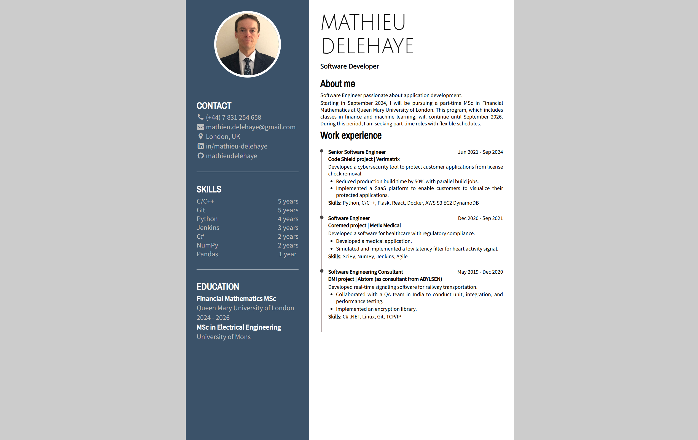
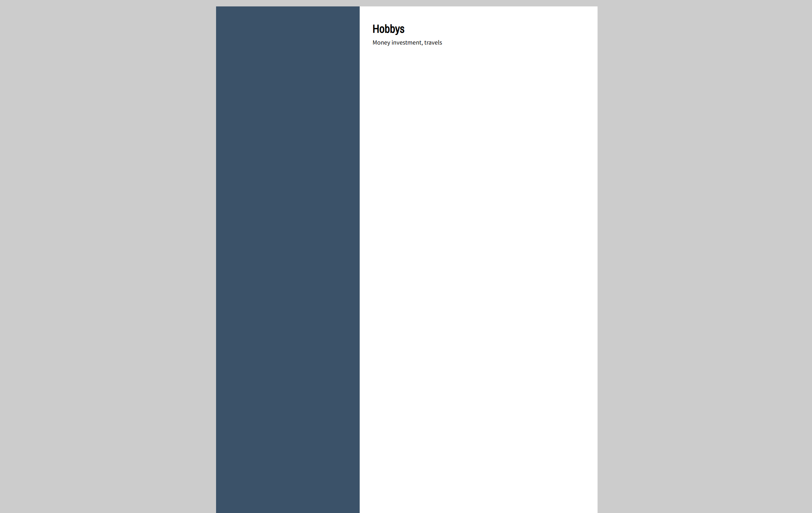

# MyResume

**Live Web3 deployment:** https://lam7g-faaaa-aaaaj-qns7q-cai.icp0.io/

This resume website is hosted on the Web3 Internet Computer blockchain: http://internetcomputer.org/

Traditional deployment: https://mathieudelehaye.github.io/MyResume/ 

<p float="left">
  
</p>

<p float="left">
  
</p>

## How-to guide

Start local backend:

```powershell
node .\server.js
```

Deploy on local dfx replica:

```bash
cd MyResume/web3-frontend
dfx identity use default
dfx start
dfx deploy --network local
# then visit the local address given by dfx
```
